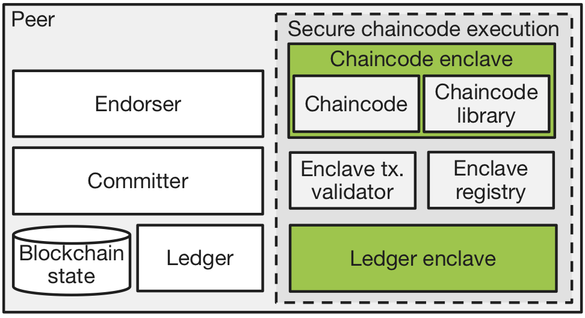

<!---
Licensed under Creative Commons Attribution 4.0 International License
https://creativecommons.org/licenses/by/4.0/
--->
# Hyperledger Fabric Private Chaincode

Hyperledger Fabric Private Chaincode (FPC) enables the execution of chaincodes
using Intel SGX for Hyperledger Fabric.

The transparency and resilience gained from blockchain protocols ensure the
integrity of blockchain applications and yet contradicts the goal to keep
application state confidential and to maintain privacy for its users.

To remedy this problem, this project uses Trusted Execution Environments
(TEEs), in particular Intel Software Guard Extensions (SGX), to protect the
privacy of chaincode data and computation from potentially untrusted peers.

Intel SGX is the most prominent TEE today and available with commodity
CPUs. It establishes trusted execution contexts called enclaves on a CPU,
which isolate data and programs from the host operating system in hardware and
ensure that outputs are correct.

This project provides a framework to develop and execute Fabric chaincode within
an enclave.  It allows to write chaincode applications where the data is
encrypted on the ledger and can only be accessed in clear by authorized
parties. Furthermore, Fabric extensions for chaincode enclave registration
and transaction verification are provided.

Fabric Private Chaicode is based on the work in the paper:

* Marcus Brandenburger, Christian Cachin, Rüdiger Kapitza, Alessandro
  Sorniotti: Blockchain and Trusted Computing: Problems, Pitfalls, and a
  Solution for Hyperledger Fabric. https://arxiv.org/abs/1805.08541

This project was accepted via a Hyperledger Fabric [RFC](https://github.com/hyperledger/fabric-rfcs/blob/main/text/0000-fabric-private-chaincode-1.0.md) and is now under development.
We provide an initial proof-of-concept implementation of the proposed
architecture. Note that the code provided in this repository is still prototype code
and not yet meant for production use!

For up to date information about our community meeting schedule, past
presentations, and info on how to contact us please refer to our
[wiki page](https://wiki.hyperledger.org/display/fabric/Hyperledger+Fabric+Private+Chaincode).

## Architecture and components

### Overview

This project extends a Fabric peer with the following components: A chaincode
enclave that executes a particular chaincode, running inside SGX.
In the untrusted part of the peer, an enclave registry maintains
the identities of all chaincode enclaves and an enclave transaction validator
that is responsible for validating transactions executed by a chaincode
enclave before committing them to the ledger.

The following diagram shows the architecture:



The system consists of the following components:

1. *Chaincode enclave:* The chaincode enclave executes one particular
   chaincode, and thereby isolates it from the peer and from other
   chaincodes. A chaincode library acts as intermediary between the chaincode
   in the enclave and the peer. The chaincode enclave exposes the Fabric
   chaincode interface and extends it with additional support for state
   encryption, attestation, and secure blockchain state access. This
   code is executed inside an Intel SGX enclave.

1. *Enclave Endorsement validation:* The enclave endorsement validation
   complements the peer’s validation system and is responsible for
   validating transactions produced by a chaincode enclave. In
   particular, the validator checks that a transaction contains a
   valid signature issued by a registered chaincode enclave. Iff the
   validation is successful, it causes the state-updates of the
   transaction to be committed to the ledger. This code is a normal Fabric
   transaction, i.e., executed and endorsed on multiple peers as
   required by the organization trust.

1. *FPC Chaincode Pkg:*
   This component bundles together the chaincode enclave and the enclave endorsement validation logic into a fabric chaincode.
   It also includes a shim component which 
   (a) proxies the chaincode enclave shim functionality, e.g., access to ledger, to the fabric peer, and
   (b) dispatches FPC flows to either the chaincode enclave (via `__invoke` queries) or to the enclave endorsement validation logic (via `__endorse` transactions).

1. *Enclave registry:* The enclave registry (`ercc`) is a chaincode that runs outside
   SGX and maintains a list of all existing chaincode enclaves in the
   network. It performs attestation with the chaincode enclave and stores the
   attestation result on the blockchain. The attestation demonstrates that a
   specific chaincode executes in an actual enclave. This enables the peers
   and the clients to inspect the attestation of a chaincode enclave before
   invoking chaincode operations or committing state changes.


### Design

More detailed architectural information and overview of the protocols can be found in the [Fabric Private Chaincode RFC](https://github.com/hyperledger/fabric-rfcs/blob/main/text/0000-fabric-private-chaincode-1.0.md).

The full detailed operation of FPC is documented in a series of UML
Sequence Diagrams. Note that FPC version 1.x corresponds to `FPC Lite`
in documents and code.

Specifically:

- The `fpc-lifecycle-v2`([puml](docs/design/fabric-v2%2B/fpc-lifecycle-v2.puml)) diagram describes the normal lifecycle of a chaincode in FPC, focusing in particular on those elements that change in FPC vs. regular Fabric.
- The `fpc-registration`([puml](docs/design/fabric-v2%2B/fpc-registration.puml)) diagram describes how an FPC Chaincode Enclave is created on a Peer and registered in the FPC Registry, including the Remote Attestation process.
- The `fpc-key-dist`([puml](docs/design/fabric-v2%2B/fpc-key-dist.puml)) diagram describes the process by which chaincode-unique cryptographic keys are created and distributed among enclaves running identical chaincodes. Note that in the current version of FPC, key generation is performed, but the key distribution protocol has not yet been implemented.
- The `fpc-cc-invocation`([puml](docs/design/fabric-v2%2B/fpc-cc-invocation.puml)) diagram illustrates the invocation process at the beginning of the chaincode lifecycle in detail, focusing on the cryptographic operations between the Client and Peer leading up to submission of a transaction for Ordering.
- The `fpc-cc-execution`([puml](docs/design/fabric-v2%2B/fpc-cc-execution.puml)) diagram provides further detail of the execution phase of an FPC chaincode, focusing in particular on the `getState` and `putState` interactions with the Ledger.
- The `fpc-validation`([puml](docs/design/fabric-v2%2B/fpc-validation.puml)) diagram describes the FPC-specific process of validation.
- The `fpc-components`([puml](docs/design/fabric-v2%2B/fpc-components.puml)) diagram shows the important data structures of FPC components and messages exchanged between components.
- The detailed message definitions can be found as [protobufs](protos/fpc).
- The [interfaces document](docs/design/fabric-v2%2B/interfaces.md) defines the interfaces exposed by the FPC components and their internal state.

Additional Google documents provide details on FPC 1.0:

- The [FPC for Health use case](https://docs.google.com/document/d/1jbiOY6Eq7OLpM_s3nb-4X4AJXROgfRHOrNLQDLxVnsc/) describes how FPC 1.0 enables a health care use case.
  The document also gives more details on the FPC 1.0-enabled application domains and related constraints. Lastly, it provides a security analysis why these constraints are sufficient for security.
- The [FPC externalized endorsement validation](https://docs.google.com/document/d/1RSrOfI9nh3d_DxT5CydvCg9lVNsZ9a30XcgC07in1BY/) describes the FPC 1.0 enclave endorsement validation mechanism.


### Source organization

- [`client_sdk`](client_sdk/go/): The FPC Go Client SDK
- [`cmake`](cmake/): CMake build rules shared across the project
- [`common`](common/): Shared C/C++ code
- [`config`](config/): SGX configuration
- [`docs`](docs/): Documentation and design documents
- [`ecc_enclave`](ecc_enclave/): C/C++ code for chaincode enclave
    (including the trusted code running inside an enclave)
- [`ecc`](ecc/): Go code for FPC chaincode package, including
    dispatcher and (high-level code for) enclave endorsement validation.
- [`ecc_go`](ecc_go/): Go code for FPC Go Chaincode Support
- [`ercc`](ercc/): Go code for Enclave Registry Chaincode
- [`samples`](samples/): FPC Samples
- [`fabric`](fabric/): FPC wrapper for Fabric peer and utilities to
    start and stop a simple Fabric test network with FPC enabled, used
    by integration tests.
- [`integration`](integration/): FPC integration tests.
- [`internal`](internal/): Shared Go code
- [`protos`](protos/): Protobuf definitions
- [`scripts`](scripts/): Scripts used in build process.
- [`utils/docker`](utils/docker): Docker images and their build process.
- [`utils/fabric`](utils/fabric): Various Fabric helpers.


## Releases

For all releases go to the [Github Release Page](https://github.com/hyperledger/fabric-private-chaincode/releases).

*WARNING: This project is in continous development and the `main`
 branch will not always be stable. Unless you want to actively
 contribute to the project itself, we advise you to use the latest release.*


## Getting started

The following steps guide you through the build phase and configuration, for
deploying and running an example private chaincode.

We assume that you are familiar with Hyperledger Fabric; otherwise we recommend the
[Fabric documentation](https://hyperledger-fabric.readthedocs.io/en/latest/getting_started.html)
as your starting point.
Moreover, we assume that you are familiar with the [Intel SGX SDK](https://github.com/intel/linux-sgx).


This README is structure as follows.
We start by [cloning the FPC repository](#clone-fabric-private-chaincode) and explain how to prepare your development environment for FPC in [Setup your FPC Development Environment](#setup-your-development-environment).
In [Build Fabric Private Chaincode](#build-fabric-private-chaincode) we guide you through the building process and elaborate on common issues.
Finally, we give you a starting point for [Developing with Fabric Private Chaincode](#developing-with-fabric-private-chaincode) by introducing the FPC Hello World Tutorial.

### Clone Fabric Private Chaincode

Clone the code and make sure it is on your `$GOPATH`. (Important: we assume in this documentation and default configuration that your `$GOPATH` has a _single_ root-directoy!)
We use `$FPC_PATH` to refer to the Fabric Private Chaincode repository in your filesystem.  
```bash
export FPC_PATH=$GOPATH/src/github.com/hyperledger/fabric-private-chaincode
git clone --recursive https://github.com/hyperledger/fabric-private-chaincode.git $FPC_PATH
```

## Setup your Development Environment

There are two different ways to develop Fabric Private Chaincode. Using our preconfigured Docker container development environment or setting up your local system with all required software dependencies to build and develop chaincode locally.

### Option 1: Using the Docker-based FPC Development Environment

In this section we explain how to set up a Docker-based development environment that allows you to develop and test FPC chaincode.
The docker images come with all necessary software dependencies and allow you a quick start.
We recommend to set privileges to manage docker as a non-root user. See the
official docker [documentation](https://docs.docker.com/install/linux/linux-postinstall/)
for more details.

First make sure your host has
* Docker 18.09 (or higher).
  It also should use `/var/run/docker.sock` as socket to interact with the daemon (or you
  will have to override in `$FPC_PATH/config.override.mk` the default definition in make of `DOCKER_DAEMON_SOCKET`)
* GNU make

Once you have cloned the repository, to pull the docker image and start the development container execute the following:
```bash
cd $FPC_PATH/utils/docker
make pull-dev 
make run-dev
```

This will fetch the FPC development image and then opens a shell inside the FPC development container, with environment variables like `$FPC_PATH` appropriately defined and all
dependencies like the Intel SGX SDK, ready to build and run FPC.

Note that by default the dev container mounts your local cloned FPC project as a volume to `/project/src/github.com/hyperledger/fabric-private-chaincode` within the docker container.
This allows you to edit the content of the repository using your favorite editor in your system and the changes inside the docker container. Additionally, you are also not loosing changes inside the container when you reboot or the container gets stopped for other reasons.

In order to build the development image manually you can use the following commands. Note that this process may take some time.
```bash
cd $FPC_PATH/utils/docker
make build-dev 
make run-dev
```

A few more notes:
* We use Ubuntu 20.04 by default.
  To build also docker images based on Ubuntu 18.04, add the following to `$FPC_PATH/config.override.mk`.
  ```bash
  DOCKER_BUILD_OPTS=--build-arg UBUNTU_VERSION=18.04 --build-arg UBUNTU_NAME=bionic
  ```
* If you run behind a proxy, you will have to configure the proxy,
  e.g., for docker (`~/.docker/config.json`). See
  [Working from behind a proxy](#working-from-behind-a-proxy) below for more information.
* If your local host is SGX enabled, i.e., there is a device `/dev/sgx/enclave` or
  `/dev/isgx` and your PSW daemon listens to `/var/run/aesmd`, then the docker image will be sgx-enabled and your settings from `./config/ias` will be used. You will have to manually set `SGX_MODE=HW` before building anything to use HW mode.
* If you want additional apt packages to be automatically added to your
  container images, you can do so by modifying `$FPC_PATH/config.override.mk` file in the fabric-private-chaincode directory.
  In that file, define
  `DOCKER_BASE_RT_IMAGE_APT_ADD_PKGS`,
  `DOCKER_BASE_DEV_IMAGE_APT_ADD_PKGS'`and/or
  `DOCKER_DEV_IMAGE_APT_ADD_PKGS` with a list of packages you want to be added to you
  all images,
  all images where fabric/fpc is built from source and
  the dev(eloper) container, respectively.
  They will then be automatically added to the docker image.
* Due to the way the peer's port for chaincode connection is managed,
  you will be able to run only a single FPC development container on a
  particular host.

Now you are ready to start development *within* the container. Continue with building FPC as described in the [Build Fabric Private Chaincode
](#build-fabric-private-chaincode) Section and then write [your first Private Chaincode](#your-first-private-chaincode).

### Option 2: Setting up your system to do local development

As an alternative to the Docker-based FPC development environment you can install and manage all necessary software dependencies which are required to compile and run FPC.  

#### Requirements

Make sure that you have the following required dependencies installed:
* Linux (OS) (we recommend Ubuntu 20.04, see [list](https://github.com/intel/linux-sgx#prerequisites) supported OS)

* CMake v3.5.1 or higher

* [Go](https://golang.org/) 1.17.5 or higher

* Docker 18.09 (or higher) and docker-compose 1.25.x (or higher)
  Note that version from Ubuntu 18.04 is not recent enough!  To upgrade, install a recent version following the instructions from [docker.com](https://docs.docker.com/compose/install/), e.g., for version 1.25.4 execute	
  ```bash	
  sudo curl -L "https://github.com/docker/compose/releases/download/1.25.4/docker-compose-$(uname -s)-$(uname -m)" -o /usr/local/bin/docker-compose	
  sudo chmod +x /usr/local/bin/docker-compose
  ```

  To install docker-componse 1.25.4 from [docker.com](https://docs.docker.com/compose/install/), execute
  ```bash
  sudo curl -L "https://github.com/docker/compose/releases/download/1.25.4/docker-compose-$(uname -s)-$(uname -m)" -o /usr/local/bin/docker-compose
  sudo chmod +x /usr/local/bin/docker-compose
  ``` 

* yq v3.x (newer versions, v4.x and higher, are currently *not* supported!)
  You can install `yq` v3 via `go get`.
  ```bash
  GO111MODULE=on go get github.com/mikefarah/yq/v3
  ```

* Protocol Buffers
    - Protocol Buffers 3.0.x needed for the Intel SGX SDK
    - Protocol Buffers 3.11.x or higher and [Nanopb](http://github.com/nanopb/nanopb) 0.4.3

* SGX PSW & SDK v2.12 for [Linux](https://01.org/intel-software-guard-extensions/downloads)
  (alternatively, you could also install it from the [source](https://github.com/intel/linux-sgx)

* Credentials for Intel Attestation Service, read [here](#intel-attestation-service-ias) (for hardware-mode SGX)

* [Intel Software Guard Extensions SSL](https://github.com/intel/intel-sgx-ssl)
  (we recommend using branch `lin_2.10_1.1.1g` OpenSSL `1.1.1g`)

* Hyperledger [Fabric](https://github.com/hyperledger/fabric/tree/v2.3.3) v2.3.3

* Clang-format 6.x or higher

* jq

* hex (for Ubuntu, found in package basez)

* A recent version of [PlantUML](http://plantuml.com/), including Graphviz, for building documentation. See [Documentation](#building-documentation) for our recommendations on installing. The version available in common package repositories may be out of date.

#### Intel SGX SDK and SSL

Fabric Private Chaincode requires the Intel [SGX SDK](https://github.com/intel/linux-sgx) and
[SGX SSL](https://github.com/intel/intel-sgx-ssl) to build the main components of our framework and to develop and build
your first private chaincode.

Install the Intel SGX software stack for Linux by following the
official [documentation](https://github.com/intel/linux-sgx). Please make sure that you use the
SDK version as denoted above in the list of requirements.

For SGX SSL, just follow the instructions on the [corresponding
github page](https://github.com/intel/intel-sgx-ssl). In case you are
building for simulation mode only and do not have HW support, you
might also want to make sure that [simulation mode is set](https://github.com/intel/intel-sgx-ssl#available-make-flags)
when building and installing it.

Once you have installed the SGX SDK and SSL for SGX SDK please double check that `SGX_SDK` and `SGX_SSL` variables
are set correctly in your environment.


#### Protocol Buffers

We use *nanopb*, a lightweight implementation of Protocol Buffers, inside the enclaves to parse blocks of
transactions. Install nanopb by following the instruction below. For this you need a working Google Protocol Buffers
compiler with python bindings (e.g. via `apt-get install protobuf-compiler python-protobuf libprotobuf-dev`).
For more detailed information consult the official nanopb documentation http://github.com/nanopb/nanopb.
```bash
export NANOPB_PATH=/path-to/install/nanopb/
git clone https://github.com/nanopb/nanopb.git $NANOPB_PATH
cd $NANOPB_PATH
git checkout nanopb-0.4.3
cd generator/proto && make
```

Make sure that you set `$NANOPB_PATH` as it is needed to build Fabric Private Chaincode.

Moreover, in order to build Fabric protobufs we also require a newer Protobuf compiler than what is provided as standard Ubuntu package and is used to build the
Intel SGX SDK. For this reason you will have to download and install another version and use it together with Nanopb. Do not install the new protobuf, though, such that it is not found in your standard PATH but instead define the `PROTOC_CMD`, either as environment variable or via `config.override.mk` to point to the new `protoc` binary
```bash
wget https://github.com/protocolbuffers/protobuf/releases/download/v3.11.4/protoc-3.11.4-linux-x86_64.zip
unzip protoc-3.11.4-linux-x86_64.zip -d /usr/local/proto3
export PROTOC_CMD=/usr/local/proto3/bin/protoc
```

#### Hyperledger Fabric

Our project fetches the latest supported Fabric binaries during the build process automatically.
However, if you want to use your own Fabric binaries, please checkout Fabric 2.3.3 release using the following commands:
```bash
export FABRIC_PATH=$GOPATH/src/github.com/hyperledger/fabric
git clone https://github.com/hyperledger/fabric.git $FABRIC_PATH
cd $FABRIC_PATH; git checkout tags/v2.3.3
```

Note that Fabric Private Chaincode may not work with the Fabric `main` branch.
Therefore, make sure you use the Fabric `v2.3.3` tag.
Make sure the source of Fabric is in your `$GOPATH`.

## Build Fabric Private Chaincode

Once you have your development environment up and running (i.e., using our docker-based setup or install all dependencies on your machine) you can build FPC and start developing your own FPC application.
Note by default we build FPC with SGX simulation mode. For SGX hardware-mode support please also read the [Intel SGX Attestation Support](#intel-sgx-attestation-support) Section below. 

To build all required FPC components and run the integration tests run the following:
```bash
cd $FPC_PATH
make
 ```

Besides the default target, there are also following make targets:
- `build`: build all FPC build artifacts
- `test`: run unit and integration tests
- `clean`: remove most build artifacts (but no docker images)
- `clobber`: remove all build artifacts including built docker images
- `checks`: do license and linting checks on source

Also note that the file `config.mk` contains various defaults which
can all be redefined in an optional file `config.override.mk`.

See also [below](#building-documentation) on how to build the documentation.


### Intel SGX Attestation Support

To run Fabric Private Chaincode in hardware mode (secure mode), you need an SGX-enabled
hardware as well corresponding OS support.  However, even if you don't
have SGX hardware available, you still can run FPC in simulation mode by
setting `SGX_MODE=SIM` in your environment.

Note that the simulation mode is for developing purpose only and does
not provide any security guarantees.

As mentioned before, by default the project builds in SGX simulation mode, `SGX_MODE=SIM` as defined in `$FPC_PATH/config.mk` and you can
explicitly opt for building in hardware-mode SGX, `SGX_MODE=HW`. In order to set non-default values for install
location, or for building in hardware-mode SGX, you can create the file `$FPC_PATH/config.override.mk` and override the default
values by defining the corresponding environment variable.

Note that you can always come back here when you want a setup with SGX
hardware-mode later after having tested with simulation mode.

#### Register with Intel Attestation Service (IAS)

If you run SGX in __simulation mode only__, you can skip this section.
We currently support EPID-based attestation and  use the Intel's
Attestation Service to perform attestation with chaincode enclaves.

What you need:
* a Service Provider ID (SPID)
* the (primary) api-key associated with your SPID

In order to use Intel's Attestation Service (IAS), you need to register
with Intel. On the [IAS EPID registration page](https://api.portal.trustedservices.intel.com/EPID-attestation)
you can find more details on how to register and obtain your SPID plus corresponding api-key.
We currently support both `linkable` and `unlinkable` signatures for the attestation.

Place your ias api key and your SPID in the `ias` folder as follows:
```bash
echo 'YOUR_API_KEY' > $FPC_PATH/config/ias/api_key.txt
echo 'YOUR_SPID_TYPE' > $FPC_PATH/config/ias/spid_type.txt
echo 'YOUR_SPID' > $FPC_PATH/config/ias/spid.txt
```
where `YOUR_SPID_TYPE` must be `epid-linkable` or `epid-unlinkable`, depending on the type of your subscription.


### FPC Playground for non-SGX environments

FPC leverages Intel SGX as the Confidential Computing technology to guard Fabric chaincodes.
Even though the Intel SGX SDK supports a simulation mode, where you can run applications in a simulated enclave, it still requires an x86-based platform to run and compile the enclave code.
Another limitation comes from the fact that the Intel SGX SDK is only available for Linux and Windows.

To overcome these limitations and allow developers to toy around with the FPC API, we provide two ways to getting started with FPC.

1) Using the [Docker-based FPC Development Environment](#setup-your-development-environment) (works well on x86-based platforms on Linux and Mac).
2) FPC builds without SGX SDK dependencies (targets x86/arm-based platforms on Linux and Mac).

We now elaborate on how to build the FPC components without the SGX SDK.
Note that this is indented for developing purpose only and does not provide any protection at all.

In your `config.override.mk` set the following to variables:
```Makefile
FPC_CCENV_IMAGE=ubuntu:20.04
ERCC_GOTAGS=
```
This configuration sets a standard Ubuntu image as alternative to our `fabric-private-chaincode-ccenv` image and overrides the default build tags we use to build `ercc`.

Next you can build `ercc` using the following command:
```bash
GOOS=linux make -C $FPC_PATH/ercc build docker
```

For building a chaincode, for instance `$FPC_PATH/samples/chaincode/kv-test-go`, just run: 
```bash
GOOS=linux make -C $FPC_PATH/samples/chaincode/kv-test-go with_go docker
```

You can test your FPC chaincode easily with one of the [sample deployments](samples/deployment) tutorials.
We recommend to start with [the-simple-testing-network](samples/deployment/fabric-smart-client/the-simple-testing-network).

Notes:
- On Mac use a recent version of bash (`brew install bash`).
- TODO more to come


### Troubleshooting

This section elaborate on common issues with building Fabric Private Chaincode.

#### Docker

Building the project requires docker. We do not recommend to run `sudo make`
to resolve issues with mis-configured docker environments as this also changes your `$GOPATH`. Please see hints on
[docker](#docker) installation above.

The makefiles do not ensure that docker files are always rebuild to
match the latest version of the code in the repo.  If you suspect you
have an issue with outdated docker images, you can run `make clobber
build` which forces a rebuild.  It also ensures that all other
download, build or test artifacts are scrubbed from your repo and might
help overcoming other problems. Be advised that that the rebuild can
take a fair amount of time.

#### Working from behind a proxy

The current code should work behind a proxy assuming
  * you have defined the corresponding environment variables (i.e.,
    `http_proxy`, `https_proxy` and, potentially, `no_proxy`) properly, and
  * docker (daemon & client) is properly set up for proxies as
    outlined in the Docker documentation for
    [clients](https://docs.docker.com/network/proxy/) and the
    [daemon](https://docs.docker.com/config/daemon/systemd/#httphttps-proxy).
  * the docker version is correct.
    Otherwise you may run into problems with DNS resolution inside the container.
  * the docker-compose version is correct.
    For example, the docker-compose from Ubuntu 18.04 (docker-compose 1.17)
    is _not_ recent enough to understand `~/.docker/config.json` and related proxy options.

Furthermore, for docker-compose networks to work properly with proxies, the `noProxy`
variable in your `~/.docker/config.json` should at least contain `127.0.0.1,127.0.1.1,localhost,.org1.example.com,.example.com`.

Another problem you might encounter when running the integration tests
insofar that some '0.0.0.0' in `integration/config/core.yaml` used by
clients -- e.g., the peer CLI using the `address: 0.0.0.0:7051` config
as part of the `peer` section -- result in the client being unable
to find the server. The likely error you will see is
 `err: rpc error: code = Unavailable desc = transport is closing`.
In that case, you will have to replace the '0.0.0.0' with a concrete
ip address such as '127.0.0.1'.


#### Environment settings

Our build system requires a few variables to be set in your environment. Missing variables may cause `make` to fail.
Below you find a summary of all variables which you should carefully check and add to your environment.

```bash
# Path to your SGX SDK and SGX SSL
export SGX_SDK=/opt/intel/sgxsdk
export SGX_SSL=/opt/intel/sgxssl

# Path to nanopb
export NANOPB_PATH=$HOME/nanopb

# SGX simulation mode
export SGX_MODE=SIM

# SGX simulation mode
export SGX_MODE=HW
```
The file `config.mk` contains various defaults for some of these, but
all can be (re)defined also in an optional file `config.override.mk`.


#### Clang-format

Some users may experience problems with clang-format. In particular, the error `command not found: clang-format`
appears even after installing it via `apt-get install clang-format`. See [here](https://askubuntu.com/questions/1034996/vim-clang-format-clang-format-is-not-found)
for how to fix this.

#### ERCC setup failures

<!-- TODO: check below, this section is probably outdated? -->

If, e.g., running the integration tests executed when you run `make`,
you get errors of following form:

```
Error: endorsement failure during invoke. response: status:500 message:"Setup failed: Can not register enclave at ercc: Error while retrieving attestation report: IAS returned error: Code 401 Access Denied"
```

In case you run in SGX HW mode, check that your files in `config/ias`
are set properly as explained in [Section Intel Attestation Service
(IAS)](#intel-attestation-service-ias).  Note that if you run
initially in simulation mode and these files do not exist, the build
will create dummy files. In case you switch later to HW mode without
configuring these files correctly for HW mode, this will result in
above error.

### Building Documentation

To build documentation (e.g., images from the PlantUML `.puml` files), you will have to install `java` and download `plantuml.jar`. Either put `plantuml.jar` into
in your `CLASSPATH` environment variable or override `PLANTUML_JAR` or `PLANTUML_CMD` in `config.override.mk`
(see `config.mk` for default definition of the two variables). Additionally, you will need the `dot` program from the
graphviz package (e.g., via `apt-get install graphviz` on Ubuntu).

By running the following command you can generate the documentation.
```bash
cd docs
make
```

## Developing with Fabric Private Chaincode

In the [samples](samples) folder you find a few examples how to develop applications using FPC and run them
on a Fabric network.
In particular, [samples/application](samples/application) contains examples of the FPC Client SDK for Go.
In [samples/chaincode](samples/chaincode) we give illustrate the use of the FPC Chaincode API;
and in [samples/deployment](samples/deployment) we show how to deploy and run FPC chaincode on the Fabric-samples test network and with K8s (minikube).

More details about FPC APIs in the [Reference Guides](#reference-guides) Section.

### Your first private chaincode

Create, build and test your first private chaincode with the [Hello World Tutorial](samples/chaincode/helloworld/README.md).


## Reference Guides

### Management API

While the management API for Fabric is mostly unchanged, some modifications are needed for FPC to work.
In particular, FPC extends the Fabric's lifecycle API with additional commands to create an FPC enclave and handle the key provisioning.
These are detailed separately in the **[FPC Management API document](docs/design/fabric-v2%2B/fpc-management.md)**

### FPC Shim

The FPC Shim follows the programming model used in the standard Fabric Go shim and offers a C++ based FPC Shim to FPC chaincode developers. It currently comprises only a subset of the standard Fabric Shim and is complemented in the future.
These details are documented separately in the Shim header file itself: **[`ecc_enclave/enclave/shim.h`](ecc_enclave/enclave/shim.h)**

*Important*: The initial version of FPC, FPC 1.0 (aka FPC Lite), has a
few constraints in applicability and programming model.  Hence, study carefully the
[section discussing this in the FPC RFC](https://github.com/hyperledger/fabric-rfcs/blob/main/text/0000-fabric-private-chaincode-1.0.md#fpc-10-application-domain)
and the comments at the top of [`shim.h`](ecc_enclave/enclave/shim.h)
before designing, implementing and deploying an FPC-based solution.
<!-- could also mention
	[FPC for Health use  case](https://docs.google.com/document/d/1jbiOY6Eq7OLpM_s3nb-4X4AJXROgfRHOrNLQDLxVnsc/)
-->


### FPC Client SDK

In order to interact with a FPC chaincode you can use the FPC Client SDK for Go or use the Peer CLI tool provided with FPC.
Both make FPC related client-side encryption and decryption transparent to the user, i.e., client-side programming is mostly standard Fabric and agnostic to FPC.

The FPC Client SDK for Go is located in [client_sdk/go](client_sdk/go). See also [Godocs](https://pkg.go.dev/github.com/hyperledger/fabric-private-chaincode/client_sdk/go/).

For the command-line invocations, use the **`$FPC_PATH/fabric/bin/peer.sh`** wrapper script. We refer to our integration tests for usage examples.

## Getting Help

Found a bug? Need help to fix an issue? You have a great idea for a new feature? Talk to us! You can reach us on
[Discord](https://discord.gg/hyperledger) in #fabric-private-chaincode.

We also have a weekly meeting every Tuesday at 3 pm GMT on [Zoom](https://zoom.us/my/hyperledger.community.3). Please
see the Hyperledger [community calendar](https://wiki.hyperledger.org/display/HYP/Calendar+of+Public+Meetings) for
details.

## Contributions Welcome

For more information on how to contribute to Fabric Private Chaincode please see our [contribution](CONTRIBUTING.md)
section.

## References

- Marcus Brandenburger, Christian Cachin, Rüdiger Kapitza, Alessandro
  Sorniotti: Blockchain and Trusted Computing: Problems, Pitfalls, and a
  Solution for Hyperledger Fabric. https://arxiv.org/abs/1805.08541

- [Fabric Private Chaincode RFC](https://github.com/hyperledger/fabric-rfcs/blob/main/text/0000-fabric-private-chaincode-1.0.md)

- Presentation at the Hyperledger Fabric contributor meeting
  August 21, 2019.
  Motivation, background and the inital architecture.
  [Slides](https://docs.google.com/presentation/d/1ewl7PcY9t27lScv2O2VaeHMsk13oe5B2MqU-qzDiR80)

- Presentation of at the Hyperledger Fabric contributor meeting
  November 11, 2020.
  The design and rationale for FPC Lite (FPC 1.0).
  [Slides](https://docs.google.com/presentation/d/1KX3_gB70H6PZw5uvYbIPYPOMt8qsh2nLRsGmXEf98Ls/edit#slide=id.ga89b65b885_0_0)


## Project Status

Hyperledger Fabric Private Chaincode was accepted via a Hyperledger Fabric [RFC](https://github.com/hyperledger/fabric-rfcs/blob/main/text/0000-fabric-private-chaincode-1.0.md) and is now under development.
Before, the project operated as a Hyperledger Labs project.
This code is provided solely to demonstrate basic Fabric Private Chaincode
mechanisms and to facilitate collaboration to refine the project architecture
and define minimum viable product requirements. The code provided in this
repository is prototype code and not intended for production use.


## Initial Committers

- [Marcus Brandenburger](https://github.com/mbrandenburger) (bur@zurich.ibm.com)
- [Christian Cachin](https://github.com/cca88) (cca@zurich.ibm.com)
- [Rüdiger Kapitza](https://github.com/rrkapitz) (kapitza@ibr.cs.tu-bs.de)
- [Alessandro Sorniotti](https://github.com/ale-linux) (aso@zurich.ibm.com)


## Core Team FPC 1.0
- [Mic Bowman](https://github.com/cmickeyb) (mic.bowman@intel.com)
- [Marcus Brandenburger](https://github.com/mbrandenburger) (bur@zurich.ibm.com)
- [Jeb Linton](https://github.com/jrlinton) (jrlinton@us.ibm.com)
- [Michael Steiner](https://github.com/g2flyer) (michael.steiner@intel.com)
- [Bruno Vavala](https://github.com/bvavala) (bruno.vavala@intel.com)


## Sponsor

[Gari Singh](https://github.com/mastersingh24) (garis@us.ibm.com)


## License

Hyperledger Fabric Private Chaincode source code files are made
available under the Apache License, Version 2.0 (Apache-2.0), located in the
[LICENSE file](LICENSE).
