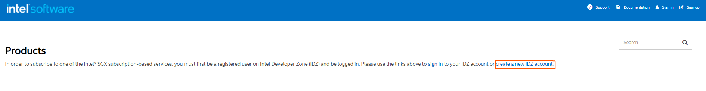

# How to use an Azure Confidential Computing Instance to run FPC in HW mode
Date of writing 14.03.2022.
This guide is based on the following sources.
[Koshi Ikegawa](https://qiita-com.translate.goog/ikegawa-koshi/items/8cf1fef1004fc16beb15?_x_tr_sl=ja&_x_tr_tl=en&_x_tr_hl=de&_x_tr_pto=wapp#fpc%E3%81%AE%E3%83%93%E3%83%AB%E3%83%89)

- [How to use an Azure Confidential Computing Instance to run FPC in HW mode](#how-to-use-an-azure-confidential-computing-instance-to-run-fpc-in-hw-mode)
  - [Creating the Confidential Computing Instance on Azure.](#creating-the-confidential-computing-instance-on-azure)
  - [Prerequisites](#prerequisites)
  - [Registering for the SGX Attestation Service Utilizing EPID](#registering-for-the-sgx-attestation-service-utilizing-epid)
    - [Known Issues](#known-issues)
  - [Building the FPC dev container](#building-the-fpc-dev-container)
  - [Final preparation of the dev-container](#final-preparation-of-the-dev-container)

## Creating the Confidential Computing Instance on Azure.
Use the [Quick Create Portal](https://docs.microsoft.com/en-us/azure/virtual-machines/linux/quick-create-portal) to create
the virtual machine.
Use the following parameters:
* OS = *Linux (ubuntu 20.04)*
* Size = Standard DC2s v2 (2 vcpus, 8 GiB memory)

## Prerequisites
Connect to your instance using ssh and execute the following commands
```bash
#update machine
sudo -i
apt-get update
apt-get upgrade
apt install -y docker docker-compose golang make
exit
#install sgx environment
#1.add sgx repo + key and then install packages form this repository
echo 'deb [arch=amd64] https://download.01.org/intel-sgx/sgx_repo/ubuntu focal main' | sudo tee /etc/apt/sources.list.d/intel-sgx.list
wget -qO - https://download.01.org/intel-sgx/sgx_repo/ubuntu/intel-sgx-deb.key | sudo apt-key add -
sudo apt-get update
sudo apt -y install libssl-dev libsgx-enclave-common libsgx-enclave-common-dev libsgx-ae-qe3 libsgx-ae-qve libsgx-epid libsgx-launch libsgx-pce-logic libsgx-qe3-logic libsgx-quote-ex libsgx-uae-service libsgx-urts
sudo reboot
```
After reboot is completed connect to your vm again.
```bash
#check if asemd service is running
sudo systemctl status aesmd.service
```
```bash
sudo usermod -aG docker $(whoami)
go env -w GO111MODULE=auto

echo 'export GOPATH=$HOME/go' >> .bashrc
echo 'export GOBIN=$GOPATH/bin' >> .bashrc
echo 'export PATH=$PATH:$GOBIN' >> .bashrc

sudo reboot
``` 
After reboot is completed connect to your vm again.
```bash
mkdir -p $GOPATH
cd $GOPATH
go get github.com/hyperledger/fabric-private-chaincode
cd  ~
echo 'export FPC_PATH=$GOPATH/src/github.com/hyperledger/fabric-private-chaincode' >> .bashrc
#you can also re-log than you don't need to set it
export FPC_PATH=$GOPATH/src/github.com/hyperledger/fabric-private-chaincode 
```

## Registering for the SGX Attestation Service Utilizing EPID
* Get a account [here](https://www.intel.com/content/www/us/en/forms/basic-intel-registration.html)
* Sign in.
* Once you are signed in go [here](here: https://api.portal.trustedservices.intel.com/EPID-attestation)
* Subscribe for development unlikable.
* You will receive a SPID, Primary Key and Secondary Key.
* Use these information to replace the appropriate places in the commands below.

```bash
echo '[YOUR_SPID]' > ${FPC_PATH}/config/ias/spid.txt
echo '[YOUR_PRIMARY_KEY]' > ${FPC_PATH}/config/ias/api_key.txt
echo 'epid-unlinkable' > ${FPC_PATH}/config/ias/spid_type.txt
```

### Known Issues
If you don't have an account and directly try to *Subscribe* to the EPID-attestation
[here](https://api.portal.trustedservices.intel.com/EPID-attestation).  And you are not signed in already with the account
trough [this](https://www.intel.com/content/www/us/en/forms/basic-intel-registration.html) then you
will be lead to the page. 
If you then click on *create new IDZ account* you will land on a
[page](https://software.intel.com/registration/?lang=en-us) saying that the site is held hostage.
Hence, you won't be able to register an account here. So please us the site
[here](https://www.intel.com/content/www/us/en/forms/basic-intel-registration.html) to register
yourselfe and just sign in on the top right on the [api
page](https://api.portal.trustedservices.intel.com/EPID-attestation) with the previously created
credentials.

## Building the FPC dev container
Edit the config.override.mk to set HW mode and DOCKER_BUILDKIT=1
```bash
vim $FPC_PATH/config.override.mk
```
paste in the following
```bash
export SGX_MODE=HW
export DOCKER_BUILDKIT=1
```
Now we can build the container
```bash
cd ${FPC_PATH}/utils/docker
make pull-dev
make run-dev
#after make run-dev you will end up in a shell in the dev container, you need to exit out
#otherwise the container stops if you ever accidentally exit the container 
exit
```
## Final preparation of the dev-container
Fist start the container and then open a shell. **Important** don't forget to exit out of the
container. The make run-dev commands leaves you in a shell of the fpc-development-main container.
However, if you close that terminal windows the container stops. So exit out, start it again,
because that the fpc-development-main container will keep running even though you close your
terminal.
```bash
docker start fpc-development-main
#you will need that command later to open multiple shells if you want
docker exec -i -t fpc-development-main bash
```
**Disclaimer** the following *make* step also executes integration tests. However, these sometimes fail with.
```
got unexpected status: SERVICE_UNAVAILABLE -- no Raft leader

```
If this keeps happening to you, than you can comment out the failing tests in the Makefile
```
vim $FPC_PATH/integration/Makefile
``` 

Anyways, to build the project call the following commands:
```bash
cd $FPC_PATH
#takes 30 sec
make clean
#takes 4 minutes
make
```