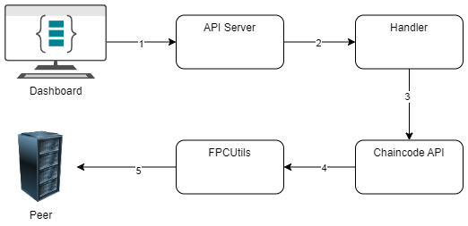

# FPC and CC-Tools integration

The goal of this project is to combine the strength of [cc-tools](https://github.com/hyperledger-labs/cc-tools) with the enhanced security capabilities of [Fabric Private Chaincode (FPC)](https://github.com/hyperledger/fabric-private-chaincode).
We describe the integration design, including the user-facing changes, the required modifications to cc-tools and FPC, and we present a guide that shows how to build, deploy, and run a Fabric chaincode built using cc-tools and FPC.
Finally, we talk about limitations that are not to be supported for the current design and on the other hand, some functionalities to support in the future.

## Motivation

In the rapidly evolving landscape of blockchain technology, privacy, and security remain paramount concerns, especially in enterprise applications where sensitive data is processed. While Hyperledger Fabric provides a robust platform for developing permissioned blockchain solutions, the need for enhanced privacy in smart contract execution has led to the development of Fabric Private Chaincode (FPC). FPC ensures that both code and data are protected during execution by leveraging trusted execution environments (TEEs), thereby enabling secure and confidential transactions.

On the other hand, the complexity of developing, testing, and deploying smart contracts (chaincode) in a decentralized environment presents its challenges. The cc-tools project, a Hyperledger Lab, is designed to streamline this process by providing a simplified, user-friendly framework for chaincode development. It reduces the time and effort required for developers to develop and test chaincode.

This project seeks to integrate the privacy guarantees of FPC with the developer-friendly environment of cc-tools to create a unified solution that offers enhanced security and ease of development. Doing so, not only improves the privacy model of smart contract execution but also simplifies the workflow for developers, making the benefits of FPC more accessible. This integration serves as a powerful tool for organizations seeking to develop secure and private decentralized applications efficiently, without compromising on usability or privacy.

## Problem Statement

This integration can't be done implicitly as both projects are not tailored to each other. cc-tools is created based on using standard Fabric networks so it doesn't handle encryption while communicating between the ledger and peers. FPC also was never tested with cc-tools packages as both utilize Fabric stub interface in their stub wrapper.

The integration between FPC and cc-tools needs to occur at two distinct levels:

Chaincode Level: The chaincode itself will be written using cc-tools to simplify its complexity and must be compatible with the privacy features of FPC. This requires modifications to the chaincode lifecycle, ensuring that it can be deployed securely using FPC while retaining the flexibility of cc-tools for development.
Note: Adhering to FPC's security requirements adds more complexity to the chaincode deployment process than with standard fabric.

Client-Side Level: The client that communicates with the peers must be adapted to handle the secure interaction between the FPC chaincode and the Fabric network. This includes managing secure communication with the TEE and ensuring that FPC's privacy guarantees are upheld during transaction processing.

Addressing these challenges is critical to enabling the seamless development and deployment of private chaincode on Hyperledger Fabric, ensuring both security and usability.
Note: the following list comprises the functionality supported by cc-tools but not yet by FPC:

* Transient data
* Events
* Private Data

## Proposed Solution

### On The Chaincode Level

In developing the chaincode for the integration of FPC and cc-tools, there are specific requirements to ensure that FPC's privacy and security features are properly leveraged. First, both FPC and cc-tools wrap the [shim.ChaincodeStub](https://github.com/hyperledger/fabric-chaincode-go/blob/acf92c9984733fb937fba943fbf7397d54368751/shim/interfaces.go#L28) interface from Hyperledger Fabric, but they must be used in a specific order for it to function. This order is determined by a few factors:

1. Stub interface order:

   cc-tools is a package that provides a relational-like framework for programming Fabric chaincodes and it translates every code to a normal Fabric chaincode at the end. cc-tools is wrapping the [shim.ChaincodeStub](https://github.com/hyperledger/fabric-chaincode-go/blob/acf92c9984733fb937fba943fbf7397d54368751/shim/interfaces.go#L28) interface from Hyperledger Fabric using [stubWrapper](https://github.com/hyperledger-labs/cc-tools/blob/995dfb2a16decae95a9dbf05424819a1df19abee/stubwrapper/stubWrapper.go#L12) and if you look for example at the [PutState](https://github.com/hyperledger-labs/cc-tools/blob/995dfb2a16decae95a9dbf05424819a1df19abee/stubwrapper/stubWrapper.go#L18) function you notice it only does some in-memory operations and it calls another `sw.Stub.PutState` from the stub passed to it (till now it was always the [stub for standard fabric](https://github.com/hyperledger/fabric-chaincode-go/blob/main/shim/stub.go)).

   ```go
   package stubwrapper

   import (
       "github.com/hyperledger-labs/cc-tools/errors"
       "github.com/hyperledger/fabric-chaincode-go/shim"
   )

   type StubWrapper struct {
       Stub        shim.ChaincodeStubInterface
       WriteSet    map[string][]byte
       PvtWriteSet map[string]map[string][]byte
   }

   func (sw *StubWrapper) PutState(key string, obj []byte) errors.ICCError {
       err := sw.Stub.PutState(key, obj)
       if err != nil {
           return errors.WrapError(err, "stub.PutState call error")
       }

       if sw.WriteSet == nil {
           sw.WriteSet = make(map[string][]byte)
       }
       sw.WriteSet[key] = obj

       return nil
   }

   ```

   On the other hand for FPC, it also wraps the [shim.ChaincodeStub](https://github.com/hyperledger/fabric-chaincode-go/blob/acf92c9984733fb937fba943fbf7397d54368751/shim/interfaces.go#L28) interface from Hyperledger Fabric but the wrapper it uses (in this case it's [FpcStubInterface](https://github.com/hyperledger/fabric-private-chaincode/blob/33fd56faf886d88a5e5f9a7dba15d8d02d739e92/ecc_go/chaincode/enclave_go/shim.go#L17)) is not always using the functions from the passed stub. With the same example as before, if you look at the [PutState](https://github.com/hyperledger/fabric-private-chaincode/blob/33fd56faf886d88a5e5f9a7dba15d8d02d739e92/ecc_go/chaincode/enclave_go/shim.go#L104) function you can notice it's not using the `sw.Stub.PutState` and going directly to the `rwset.AddWrite` (this is specific to FPC use case as it's not using the Fabric proposal response). However, there still are some other functions where the passed `stub` functions are being used.

   ```go
   package enclave_go

   import (
       "github.com/hyperledger/fabric-chaincode-go/shim"
       pb "github.com/hyperledger/fabric-protos-go/peer"
   )

   type FpcStubInterface struct {
       stub  shim.ChaincodeStubInterface
       input *pb.ChaincodeInput
       rwset ReadWriteSet
       sep   StateEncryptionFunctions
   }

   func (f *FpcStubInterface) PutState(key string, value []byte) error {
       encValue, err := f.sep.EncryptState(value)
       if err != nil {
           return err
       }
       return f.PutPublicState(key, encValue)
   }

   func (f *FpcStubInterface) PutPublicState(key string, value []byte) error {
       f.rwset.AddWrite(key, value)

       // Note that since we are not using the Fabric proposal response  we can skip the putState call
       // return f.stub.PutState(key, value)
       return nil
   }
   ```

   This was also tested practically by logging during the invocation of a transaction that uses the PutState functionality.
   

   For this, It's better to inject the FPC stub wrapper in the middle between Fabric stub and cc-tools stub wrapper.
2. The order needed by how the flow of the code works:
   Since the cc-tools code is translated to normal Fabric chaincode before communicating with the ledger, the cc-tools code itself doesn't communicate with the ledger but performs some in-memory operations and then calls the same shim functionality from the Fabric code (as explained above).

   For FPC, it changes the way dealing with the ledger as it deals with decrypting the arguments before committing the transaction to the ledger and encrypting the response before sending it back to the client.

   To meet this requirement, the chaincode must be wrapped with the FPC stub wrapper before being passed to the cc-tools wrapper.
   

   Here's an example of how the end user enables FPC for a cc-tools-based chaincode.

   ```go
   var cc shim.Chaincode
   if os.Getenv("FPC_ENABLED") == "true" {
       // *Wrap the chaincode with FPC wrapper*//
       cc = fpc.NewPrivateChaincode(new(CCDemo))
   } else {
       cc = new(CCDemo)
   }
   server := &shim.ChaincodeServer{
       CCID:     ccid,
       Address:  address,
       CC:       cc,
       TLSProps: *tlsProps,
   }
   return server.Start()
   ```

   Note: For this code to work, there are more changes required to be done in terms of packages, building, and the deployment process. We'll go into this in the [User Experience](#user-experience) section.

<br>

### The Chaincode Deployment Process

The chaincode deployment process must follow the FPC deployment flow, as cc-tools adheres to the standard Fabric chaincode deployment process, which does not account for FPC’s privacy enhancements. Since FPC is already built on top of Fabric’s standard processes, ensuring that the deployment follows the FPC-specific flow will be sufficient for integrating the two tools. This means taking care to use FPC’s specialized lifecycle commands and processes during deployment, to ensure both privacy and compatibility with the broader Hyperledger Fabric framework.

1. After the chaincode is agreed upon and built (specifying the MRENCLAVE as the chaincode version), we start to initialize this chaincode enclave on the peers (Step 1).
2. The administrator of the peer hosting the FPC Chaincode Enclave initializes the enclave by executing the `initEnclave` admin command (Step 2).
3. The FPC Client SDK then issues an `initEnclave` query to the FPC Shim, which initializes the enclave with chaincode parameters, generates key pairs, and returns the credentials, protected by an attestation protocol (Steps 3-7).
4. The FPC Client SDK converts the attestation into publicly verifiable evidence through the Intel Attestation Service (IAS), using the hardware manufacturer's root CA certificate as the root of trust (Steps 8-9).
5. A `registerEnclave` transaction is invoked to validate and register the enclave credentials on the ledger, ensuring they match the chaincode definition, and making them available to channel members (Steps 10-12).


For more details about this, refer to the FPC chaincode deployment process section in the FPC RFC document [here](https://github.com/hyperledger/fabric-rfcs/blob/main/text/0000-fabric-private-chaincode-1.0.md#deployment-process).

### On The Client Side Level

Similarly, as cc-tools is a framework for developing the chaincode which is normally translated to Fabric chaincode (now also Fabric Private Chaincode), the client transaction invocation flow is not affected by cc-tools but it must follow the FPC transaction flow for encryption and decryption operations to meet the security requirements asserted by FPC.

1. Step 1-5: FPC Client SDK Invocation : The client application invokes FPC Chaincode via the SDK, which retrieves the chaincode's public encryption key from the Enclave Registry and encrypts the transaction proposal in addition to a symmetric client response key.
2. Step 6-7: Chaincode Execution : The encrypted proposal is processed by the FPC Shim inside the Enclave, which decrypts the arguments and executes the chaincode logic using the World State.
3. Step 8-9: State Encryption : The FPC Shim uses the State Encryption Key to securely handle state data during chaincode execution, encrypting and authenticating data exchanges.
4. Step 10: Result Encryption and Endorsement : The FPC Shim encrypts the result with the client's response key generated at step 5, signs it, and sends it to the peer for regular Fabric endorsement.
5. Step 11-13: Enclave Endorsement Validation : The FPC Client SDK validates the enclave's signature and the read/write set, decrypts the result, and delivers it back to the client application.


For more details about this, refer to the FPC transaction flow section in the FPC RFC document [here](https://github.com/hyperledger/fabric-rfcs/blob/main/text/0000-fabric-private-chaincode-1.0.md#fpc-transaction-flow).

#### Client Example: cc-tools-demo

The following diagram explains the process where we modified the API server developed for a demo on cc-tools ([CCAPI](https://github.com/hyperledger-labs/cc-tools-demo/tree/main/ccapi)) and modified it to communicate with FPC code.

The transaction client invocation process, as illustrated in the diagram, consists of several key steps that require careful integration between FPC and cc-tools.

1. Step 1-2: The API server is listening for requests on a specified port over an HTTP channel and sends it to the handler.
2. Step 3: The handler starts by determining the appropriate transaction invocation based on the requested endpoint and calling the corresponding chaincode API.
3. Step 4: The chaincode API is responsible for parsing and ensuring the payload is correctly parsed into a format that is FPC-friendly. This parsing step is crucial, as it prepares the data to meet FPC’s privacy and security requirements before it reaches the peer.
4. Step 5: FPCUtils is the step where the actual transaction invocation happens and it follows the steps explained in the previous diagram as it builds on top of the FPC Client SDK.



## User Experience

We will describe from a user perspective a high overview of how to develop a chaincode using cc-tools that works with FPC achieving both ease of development and enhanced security of the chaincode.

### 1. Setting up the FPC dev environment

First, any chaincode that is supposed to be working with FPC needs some dependencies to develop and build the chaincode like Ego, Protocol Buffers, SGX PSW, etc...

For this, we should follow this section in the FPC repo to set the development environment [here](https://github.com/hyperledger/fabric-private-chaincode/tree/main?tab=readme-ov-file#getting-started).

### 2. Develop the chaincode in cc-tools and FPC

Fortunately, since the stub wrapper for both cc-tools and FPC are implementing the same interface, the conversion to an FPC chaincode can be done by plug-and-play. This means the user should start by developing the chaincode using cc-tools, and at the main loop where they pass the chaincode instance to the server to start it, they need to wrap it with `fpc.NewPrivateChaincode`. For example, have a look at the cc-tools-demo chaincode below.
Before:

```go
func runCCaaS() error {
    address := os.Getenv("CHAINCODE_SERVER_ADDRESS")
    ccid := os.Getenv("CHAINCODE_ID")

    tlsProps, err := getTLSProperties()
    if err != nil {
        return err
    }

    server := &shim.ChaincodeServer{
      CCID:     ccid,
      Address:  address,
      CC:       new(CCDemo),
      TLSProps: *tlsProps,
    }

    return server.Start()
}
```

After:

```go

// Import the FPC package first
import (
    fpc "github.com/hyperledger/fabric-private-chaincode/ecc_go/chaincode"
)

func runCCaaS() error {
    address := os.Getenv("CHAINCODE_SERVER_ADDRESS")
    ccid := os.Getenv("CHAINCODE_ID")

    tlsProps, err := getTLSProperties()
    if err != nil {
        return err
    }

    //*Wrap the chaincode with FPC wrapper*//
    var cc shim.Chaincode
    if os.Getenv("FPC_ENABLED") == "true" {
      cc = fpc.NewPrivateChaincode(new(CCDemo))
    } else {
      cc = new(CCDemo)
    }

    server := &shim.ChaincodeServer{
      CCID:     ccid,
      Address:  address,
      CC:       cc,
      TLSProps: *tlsProps,
    }
    return server.Start()
}
```

Also, the user needs to install and update dependencies before building the code. We did mention that the interface is the same between the two wrappers but for some cases like the cc-tools-demo mock stub it was not implementing the `PurgePrivateData` function so it was breaking as FPC was implementing the function with `Panic(not Implemented)`. Managing private data is not supported with FPC but it has to adhere to the stub Interface of the standard Fabric shim API which requires it. Since the cc-tools mock stub was an imported package, a good solution is to use `go mod vendor` and download all go packages in the vendor directory and edit it one time there. Running `nano $FPC_PATH/vendor/github.com/hyperledger-labs/cc-tools/mock/mockstub.go` and put the following block there:

```go
// PurgePrivateData ...
func (stub *MockStub) PurgePrivateData(collection, key string) error {
     return errors.New("Not Implemented")
}
```

Also, if you find other conflicts with the FPC standard packages released it may be a better option to copy your chaincode inside `$FPC_PATH/samples/chaincode/<YOUR_CHAINCODE>` since you've already followed [step 1](#1-setting-up-the-fpc-dev-environment) to setup the dev environment. And then you use the FPC package locally from within `import (fpc "github.com/hyperledger/fabric-private-chaincode/ecc_go/chaincode")`. More on this is driven by this [FPC tutorial](https://github.com/osamamagdy/fabric-private-chaincode/blob/feat/create-sample-app/samples/chaincode/simple-asset-go/README.md#writing-go-chaincode).

#### Build the chaincode

After setting up the development environment, you can build the chaincode using the [Ego](https://pkg.go.dev/github.com/edgelesssys/ego) framework which is necessary to run in encrypted enclaves. You can use the FPC build Makefile [here](https://github.com/osamamagdy/fabric-private-chaincode/blob/feat/create-sample-app/ecc_go/build.mk) but you need to point the `CC_NAME` to it. The chaicode will be present as a docker image as the Fabric network is using docker-compose.

#### Start the Fabric network

Now that we have the chaincode built and ready to be deployed, we need to start the Fabric network before going any further. We're following the FPC [guide](https://github.com/osamamagdy/fabric-private-chaincode/tree/feat/create-sample-app/samples/deployment/test-network#prepare-the-test-network) for preparing and starting the network.

#### Install the chaincode

FPC provides another `installFPC.sh` script for installing the chaincode on the peers but first, we must make sure to set the `CC_ID` with the chaincode name and `CC_VER` with the path to the `mrenclave` of that chaincode. Then we run the script and also start the chaincode containers like [here](https://github.com/osamamagdy/fabric-private-chaincode/tree/feat/create-sample-app/samples/deployment/test-network#install-and-run-the-fpc-chaincode).

#### Work with the client application

As explained in the [client](#on-the-client-side-level) section we're following the standard by FPC so using a client application based on the FPC client SDK is the way to go. In [here](https://github.com/osamamagdy/fabric-private-chaincode/blob/feat/create-sample-app/samples/chaincode/simple-asset-go/README.md#invoke-simple-asset) is a guide on how to build and use an FPC client cli to communicate with the chaincode. It builds the tool, updates the connection configurations, initializes the enclave, and invokes the transactions. All you need to do is edit the chaincode parameters like `CC_NAME`, `CHANNEL_NAME` , etc...

## Limitations

There are some standard Fabric features that are not compatible with the security properties of FPC and how FPC works and it's not part of our intention to support.

The following functionalities are not yet supported:

* `GetTransient()` and `GetBinding()`: This is not needed as the application-level confidentiality is handled by the FPC client invocation approach.

## Future work

The following functionalities are beyond the scope of the integration project as they're missing functionalities on the FPC side and once they're implemented, they can be easily integrated and will work with cc-tools.

* Add support for [private data collections](https://hyperledger-fabric.readthedocs.io/en/latest/private-data/private-data.html) for FPC chaincodes.
* Complex rich queries and range queries (CouchDB).
* `SplitCompositeKey()` to retrieve its original attributes.
* `GetHistoryForKey()`.
* Propper handling of transactions' timestamps.
* `GetDecorations()` mentioned [here](https://github.com/hyperledger/fabric-rfcs/blob/main/text/0000-fabric-private-chaincode-1.0.md#fabric-features-not-yet-supported) to be added in the future.
* Using events.
