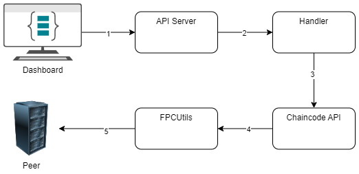

# CCAPI - A web server developed to interface with CC-tools chaincode

## Motivation

As continuation to the [cc-tools-demo]() tutorial on how to integrate the cc-tools project with FPC chaincodes, we start by utilizing another powerful solution offered by cc-tools which is the CCAPI. It's a complete web server that simplifies the communication with the peers and Fabric components to replace the need to deal with CLI applications.

## Architecture

The following diagram explains the process where we modified the API server developed for a demo on cc-tools ([CCAPI](https://github.com/hyperledger-labs/cc-tools-demo/tree/main/ccapi)) and modified it to communicate with FPC code.

The transaction client invocation process, as illustrated in the diagram, consists of several key steps that require careful integration between FPC and cc-tools.

1. Step 1-2: The API server is listening for requests on a specified port over an HTTP channel and sends it to the handler.
2. Step 3: The handler starts by determining the appropriate transaction invocation based on the requested endpoint and calling the corresponding chaincode API.
3. Step 4: The chaincode API is responsible for parsing and ensuring the payload is correctly parsed into a format that is FPC-friendly. This parsing step is crucial, as it prepares the data to meet FPC’s privacy and security requirements before it reaches the peer.
4. Step 5: FPCUtils is the step where the actual transaction invocation happens and it follows the steps explained in [here](https://github.com/hyperledger/fabric-rfcs/blob/main/text/0000-fabric-private-chaincode-1.0.md#fpc-transaction-flow) as it builds on top of the FPC Client SDK.

## User Experience

CCAPI is using docker and docker-compose for spinning up all the required components needed to work.

Have a look at the [fpc-docker-compose.yaml](./fpc-docker-compose.yaml) to see how we use different env vars. Most of these environment variables are required by any client application to work and communicate with FPC. If you followed the [cc-tools-demo](../../chaincode/cc-tools-demo/README.md) tutorial, the values should be the same.

Start by running `docker-compose -f fpc-docker-compose.yaml up` then go to the browser and type `localhost:80` to open the swagger api and start executing functions.

## Future work

CCAPI have another component for the dashboard frontend application but it's not yet utilized with
